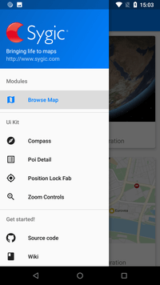
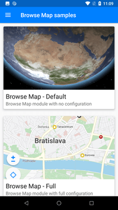
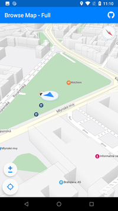
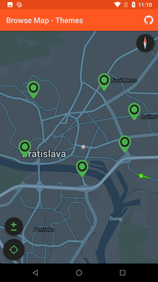

# SygicMapsKit - Android

A powerful open-source library based on [Sygic Maps SDK][5] which can be used to display rich map content and interact with it.
(if you are looking for a iOS version, you can find it [here][4])

<p align="center"></p>

## Getting Started

To get familiar with all the features available, you can first try out our Sample App. Get it from [Google Play][7] or download [APK][8] (coming soon).

[](assets/images/screenshot_0_orig.png)[](assets/images/screenshot_1_orig.png)[](assets/images/screenshot_2_orig.png)[](assets/images/screenshot_3_orig.png)

### Prerequisites

1. **Request the Sygic API key**. To start developing with Sygic Maps SDK, please [fill this form][6] and get your API key.

2. Specify these Gradle properties:

    ```gradle
    android {
        dataBinding {
            enabled = true
        }
        compileOptions {
            sourceCompatibility 1.8
            targetCompatibility 1.8
        }
    }
    ```

### Installing

You can download a AAR from GitHub's [releases page][1].

Or use Gradle (coming soon):

```gradle
repositories {
    mavenCentral()
    google()
}

dependencies {
    implementation 'com.sygic.modules:browsemap:1.0.0'
}
```

Or checkout the repo and include it to your project:

*settings.gradle*
 ```gradle
include ':modules-browsemap'
project(':modules-browsemap').projectDir = new File("path to the repo root folder/modules/browsemap")
```
*build.gradle*
```gradle
dependencies {
    implementation fileTree(dir: 'libs', include: ['*.jar'])
    implementation project(':modules-browsemap')
}
```

Finally, you need to add your API key to the Android Manifest:

```xml
<manifest
    package="com.sygic.samples">
    <application>

    <meta-data
        android:name="@string/com_sygic_api_key"
        android:value="place your API key here" />
    </application>
</manifest>
```

### Basic Usage

Simply put the BrowseMapFragment to your layout container:

```xml
<FrameLayout
    xmlns:android="http://schemas.android.com/apk/res/android"
    android:layout_width="match_parent"
    android:layout_height="match_parent">

    <fragment
        android:id="@+id/browseMapFragment"
        class="com.sygic.modules.browsemap.BrowseMapFragment"
        android:layout_width="match_parent"
        android:layout_height="match_parent" />

</FrameLayout>
```

for more usage examples go to the [Wiki][2] page.

## Help

First read the [Wiki][2] page, then try to search on [Stackoverflow][9] or visit the GitHub [issues][3] page.

## Authors

* **Miroslav Kacera** - *Primary contributor & Team Leader* - [bio007][10]
* **Tomáš Valenta** - *Primary contributor* - [YAV][11]

## License

    This project is licensed under the MIT License

    Copyright (c) 2019 - Sygic a.s.

    Licensed under the Apache License, Version 2.0 (the "License");
    you may not use this file except in compliance with the License.
    You may obtain a copy of the License at

       http://www.apache.org/licenses/LICENSE-2.0

    Unless required by applicable law or agreed to in writing, software
    distributed under the License is distributed on an "AS IS" BASIS,
    WITHOUT WARRANTIES OR CONDITIONS OF ANY KIND, either express or implied.
    See the License for the specific language governing permissions and
    limitations under the License.
    
[1]: https://github.com/Sygic/sygic-maps-kit-android/releases
[2]: https://github.com/Sygic/sygic-maps-kit-android/wiki
[3]: https://github.com/Sygic/sygic-maps-kit-android/issues
[4]: https://github.com/Sygic/sygic-maps-kit-ios/
[5]: https://www.sygic.com/enterprise/maps-navigation-sdk-api-developers
[6]: https://www.sygic.com/enterprise/get-api-key/
[7]: #
[8]: #
[9]: https://stackoverflow.com/questions/tagged/android+sygic
[10]: https://github.com/bio007
[11]: https://github.com/TomasValenta
